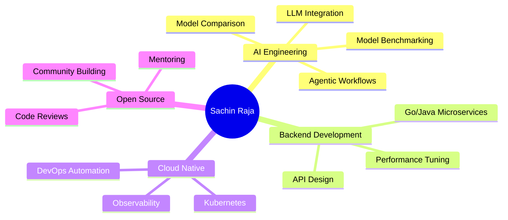

<div align="center">


[](https://github.com/kindcli) [](https://github.com/kindcli)

</div>

---

## 🎯 **About Me**

```go
package main

import "fmt"

func main() {
    name := "Sachin Raja"
    role := "Senior Software & AI Engineer"
    focus := "AI | Cloud-Native Distributed Systems | Go Backend | Agentic Workflows"
    exp := 2026 - 2016
    philosophy := "It is not enough to get things done; they must be done right."
    passions := "Optimizing systems, building intelligent workflows, mentoring devs, contributing to OSS"

    fmt.Printf("👋 Hi, I'm %s\n", name)
    fmt.Printf("🚀 %s with %d+ years of experience building scalable, high-performance systems\n", role, exp)
    fmt.Printf("💡 Focused on: %s\n", focus)
    fmt.Printf("🌍 Working remotely, judging hackathons & giving back to the community\n")
    fmt.Printf("🔥 Passionate about: %s\n", passions)
    fmt.Printf("🧠 Philosophy: \"%s\"\n", philosophy)
}


```

---

## 🛠️ Tech Arsenal

<div align="center">

| Category | Tech Stack |
|:--------:|:----------|
| 🔥 Core Languages |  |
| ⚡ Backend & APIs |  |
| ☁️ Cloud & DevOps |  |
| 🤖 AI & ML Stack |   |
| 🗄️ Databases & Storage |  |
| 🔧 Tools & Platforms |  |

</div>

---


---


## 📊 **GitHub Analytics**

<div align="center">
    
</div>

<div align="center">
    
</div>

---

## 💼 **Experience Highlights**

<table align="center">
<tr>
<td width="50%">

### 🚀 **Backend Engineering**

```yaml
Expertise:
  - RESTful & GraphQL APIs
  - Microservices Architecture
  - High-Performance Go Services
  - SOAP Integration & Modernization
  - Database Optimization
```

</td>
<td width="50%">

### 🤖 **AI & Automation**

```yaml
Specializations:
  - Agentic AI Workflows
  - LLM Integration & Fine-tuning
  - Browser Automation
  - Embedding Classifiers
  - Prompt Engineering
```

</td>
</tr>
<tr>
<td width="50%">

### ☁️ **Cloud Architecture**

```yaml
Platforms:
  - AWS Native Solutions
  - Container Orchestration
  - CI/CD Pipelines
  - Infrastructure as Code
  - Observability & Monitoring
```

</td>
<td width="50%">

### 🔍 **Performance & Scale**

```yaml
Focus Areas:
  - Application Profiling
  - OpenTelemetry Implementation
  - Load Testing & Optimization
  - Distributed Tracing
  - Performance Engineering
```

</td>
</tr>
</table>

---

## 📈 **Contribution Graph**

<div align="center">
    
</div>

<div align="center">
    
    
</div>

<div align="center">
    
    
</div>

---

## 🌟 **Current Focus Areas**

<div align="center">



</div>

---

<div align="center">

| Skill / Focus | Experience Timeline | Total Years |
|---------------|------------------|------------|
| ⚡ **Backend Development** | 🟩🟩🟩🟩🟩🟩🟩🟩 | 8+ |
| ☁️ **Cloud Architecture (AWS/GCP)** | 🟩🟩🟩🟩🟩 | 5+ |
| 🤖 **AI/ML Engineering** | 🟩🟩🟩🟩🟩 | 5+ |
| 🛠️ **DevOps & CI/CD** | 🟩🟩🟩🟩🟩🟩🟩 | 7+ |
| 📦 **Microservices Design** | 🟩🟩🟩🟩🟩🟩 | 6+ |
| ⚡ **Performance Optimization** | 🟩🟩🟩🟩🟩🟩 | 6+ |

</div>


---

## 📫 **Let's Connect & Collaborate**

<div align="center">

<a href="https://www.linkedin.com/in/sachinraja1993/">
    
</a>
<a href="https://kindcli.github.io/kindcli/">
    
</a>

---

<div align="center">

### 💭 **"Code is poetry written for machines, but read by humans"**


**⭐ From [Sachin Raja](https://github.com/kindcli) - Building the future, one commit at a time**


</div>
